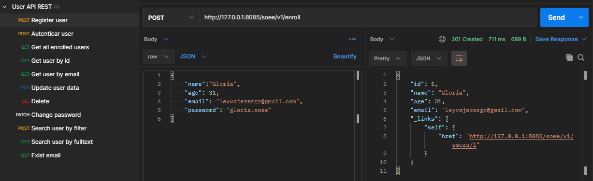
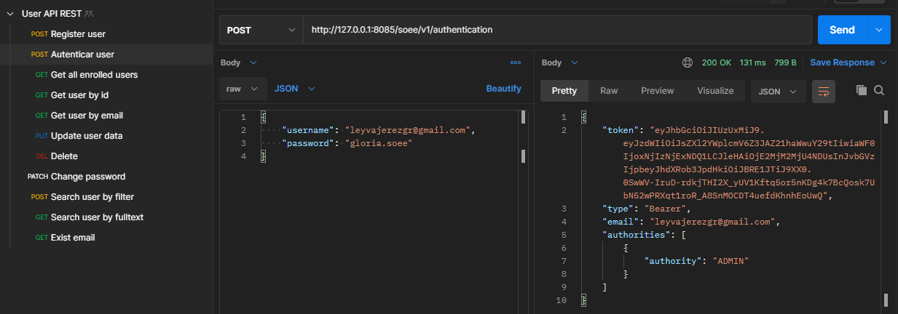
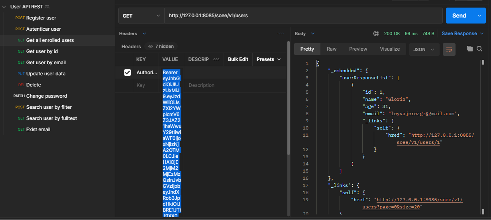

# MANAGE USER API REST
En este ejercicio desarrollo una API REST para gestionar usuarios empleando `Spring Boot`, `Spring Security` y `Spring Data JPA`. El almacenamiento de los datos se realiza en la base de datos `PostgreSQL` o en memoria usando `H2`, mediante la activación por variable de entorno que indica el modo de persistencia. La API fue documentada con `Open API Swagger` y testeada con `Postman` y pruebas automatizadas con `JUnit`. Los paquetes fueron estructurados siguiendo `Domain Driver Design` y se aplicaron patrones como Adapter, Fábricas, Repositorios entre otros. Para optimizar las consultas dado el volumen de datos manejados se emplea `HATEOAS` para `Paginación` y manejo de hipertexto, compresión `gzip` y se ha habilitado `HTTP2` (apartado #Optimization del `aplication.properties` ).

## Despliegue
1. Como IDE de desarrollo se emplea `Intellij IDEA`. Descargar [aquí](https://www.jetbrains.com/es-es/idea/download/).
     - Instalar en el IDE el plugin `Lombok`. Para Intellij descargar [aquí](https://plugins.jetbrains.com/plugin/6317-lombok/). 
   
2. Para gestionar las dependencia se emplea `MAVEN`. Descargar [aquí](https://maven.apache.org/download.cgi/).

    - El `pom/xml` contiene todas las dependencias que deben ser descargadas para el despliegue de este proyecto.
      
3. Para la persistencia en memoria se emplea `H2`. 
    - Descargar para Windows [aquí](https://h2database.com/h2-setup-2019-03-13.exe)
    - Descargar para Linux [aquí](https://h2database.com/h2-2019-03-13.zip). Puede seguir esta guía [aquí](https://o7planning.org/11895/install-h2-database-and-use-h2-console)
    - Puede modificar la configuración de H2 como nombre de la base de datos, puerto y host mediante el `aplication.properties`

4. Para la persistencia en base de datos se emplea `PostgreSQL`. 

5. `Postman` para probar los endpoint de las APIs. Descargar [aquí](https://www.postman.com/downloads/).

6. Debe tener libre el puero 8085 o modificar la variable `server.port` en el `aplication.properties`
     
## Persitencia
Para poder seleccionar el modo de almacenamiento de dispone de la variable de configuración `app.persistence.type` ubicada en el `application.properties`.
la aplicación trabaja de un modo o de otro, no utiliza los dos de forma simultánea.

- Activar la persistencia en memoria: `app.persistence.type=memory`
- Activar la persistencia en base de datos: `app.persistence.type=db`

En ambos casos podrá configurar los pueros y datos de conexión:
- Para H2:

        db.name=demo
        db.h2.username=sa
        db.h2.password=

- Para postgres:
    
        db.sql.username=postgres
        db.sql.password=postgres
        db.sql.port=5432
            
## Restricciones y endpoints
En la carpeta `readme` adjunta en el proyecto se encuentra el archivo `User_API_REST.postman_collection.json` el cual contiene los endpoints desarrollados,
los cuales puede ser importado en Postman.

El ejercicio consta de 3 endpoints fundamentales. 

Endpoint #1 Alta de usuarios
 - POST /soee/v1/enroll
 - Ejemplo: http://127.0.0.1:8085/soee/v1/enroll
   
   
  
Endpoint #2 Autenticar usuarios
 - POST /soee/v1/authentication
 - Ejemplo: http://127.0.0.1:8085/soee/v1/authentication
   
   
   
Endpoint #3 Listado de usuarios dados de Alta
 - GET /soee/v1/users
 - Ejemplo: http://127.0.0.1:8085/soee/v1/users
   
   
   
Se han desarrollado otros endpoints que se encuentan documentados con open-api/swagger:
- Una vez que el proyecto esté corriendo, podrá acceder a la documentación mediante el enlace: `http://localhost:8085/soee-demo-api-docs`

## Archivos y clases fundamentales
- El archivo `application.properties` contiene las configuraciones del proyecto como puerto, perisitencia en memoria con H2, configuraciones de compresión gzip y http2 y ruta para la documentación.
- La clase `URIConstant` centraliza las URI del proyecto para favorecer la reutilización.
- La clase `SwaggerDocumentation` almacenan los propeties de la documentación de la api y así simplificar la clase controladora.
- La clase `AuthenticationRestController` es la responsable de la autenticación de los usuarios.
- La clase `ManageUserRestController` es la API REST del ejercicio que gestiona el manejo de los usuarios: altas, listado de altas, detalles, edició, filtrado, etc (consultar documentación de la apis).
- La clase `PersistenceConfig` contiene las variables de entorno y realiza la activación del modo de persistenca.

## Testing
Se implementaron `test` para las funcionalidades principales del ejercicio.

